# Mindhive AI Chatbot Engineer Assessment

**Technical Assessment Submission for Mindhive's AI Chatbot Engineer Role**

A production-ready conversational AI chatbot implementing all 5 parts of the Mindhive technical assessment, demonstrating multi-turn conversations, agentic planning, tool integration, RAG pipelines, and robust error handling.

## 🌐 **Live Demo**

**Production URL**: https://mindhive-chatbot-yvsu2loedq-uc.a.run.app  
**API Documentation**: https://mindhive-chatbot-yvsu2loedq-uc.a.run.app/docs

## **🧪 What Can Be Tested Where**

| Assessment Part | Local Testing | Live API | How to Test |
|----------------|---------------|----------|-------------|
| **Part 1**: Sequential Conversation | ✅ Required | ❌ N/A | `python chatbot/memory_bot.py` |
| **Part 2**: Agentic Planning | ✅ Required | ❌ N/A | See [instructions below](#testing-parts-1--2-interactively) |
| **Part 3**: Calculator | ✅ Available | ✅ Available | [Live Demo](https://mindhive-chatbot-yvsu2loedq-uc.a.run.app/calculator?expr=2%2B3*4) |
| **Part 4**: RAG Products | ✅ Available | ✅ Available | [Live Demo](https://mindhive-chatbot-yvsu2loedq-uc.a.run.app/products?query=ceramic+mug) |
| **Part 5**: Text2SQL Outlets | ✅ Available | ✅ Available | [Live Demo](https://mindhive-chatbot-yvsu2loedq-uc.a.run.app/outlets?query=outlets+in+Petaling+Jaya) |

## 🚀 **Quick Test**

Try these working examples:
- **Calculator**: [2+3*4](https://mindhive-chatbot-yvsu2loedq-uc.a.run.app/calculator?expr=2%2B3*4)
- **Product Search**: [Find ceramic mugs](https://mindhive-chatbot-yvsu2loedq-uc.a.run.app/products?query=ceramic+mug)
- **Outlet Query**: [Outlets in PJ](https://mindhive-chatbot-yvsu2loedq-uc.a.run.app/outlets?query=outlets+in+Petaling+Jaya)

---

## 📋 **Assessment Implementation Overview**

### **✅ Part 1: Sequential Conversation (State Management & Memory)**

**Objective**: Keep track of at least three related turns with slot/variable tracking.

**Implementation**:
- **Framework**: LangChain with `ConversationBufferMemory`
- **Memory Persistence**: Conversation history maintained across turns
- **State Tracking**: Context-aware responses using previous conversation

**Example Flow** (as specified in assessment):
```
1. User: "Is there an outlet in Petaling Jaya?"
2. Bot: "Yes! I found 2 outlets in Petaling Jaya. Which specific location?"
3. User: "SS2, what's the opening time?"
4. Bot: "The ZUS Coffee SS2 outlet opens at 7:00 AM and closes at 10:00 PM daily."
```

**Files**: `chatbot/memory_bot.py`, `tests/test_memory.py`

### **✅ Part 2: Agentic Planning (Planner/Controller Logic)**

**Objective**: Show how the bot decides its next action (ask, call tool, or finish).

**Implementation**:
- **Intent Parsing**: Analyzes user input to determine intent
- **Action Selection**: Chooses between ASK, CALCULATE, RAG_SEARCH, SQL_QUERY, or END
- **Missing Information Detection**: Identifies incomplete requests and asks follow-ups
- **Confidence Scoring**: Uses confidence levels to make decisions

**Decision Flow**:
1. Parse user intent and extract entities
2. Identify missing information for complete action
3. Choose appropriate action based on intent and completeness
4. Execute action and return structured response

**Files**: `chatbot/planner.py`, `tests/test_planner.py`

### **✅ Part 3: Tool Calling (Calculator API Integration)**

**Objective**: Integrate Calculator Tool for arithmetic with error handling.

**Implementation**:
- **Safe Evaluation**: AST-based expression parsing prevents code injection
- **Tool Integration**: LangChain Tool wrapper for seamless integration
- **Error Handling**: Graceful handling of malformed expressions, division by zero
- **Security**: Input sanitization against malicious code execution

**Example Transcripts**:
```
✅ Success: "Calculate 2+3*4" → "The result is 14"
❌ Failure: "Calculate invalid" → "I couldn't evaluate that expression. Please provide a valid mathematical expression like '2+3' or '(10-5)*2'."
```

**Files**: `app/calculator.py`, `chatbot/tools.py`, `tests/test_calculator.py`

### **✅ Part 4: Custom API & RAG Integration**

**Objective**: Build FastAPI endpoints for domain data with RAG and Text2SQL.

#### **4.1 Product-KB Retrieval Endpoint**
- **Data Source**: ZUS Coffee Drinkware from https://shop.zuscoffee.com/ (Drinkware category)
- **Vector Store**: FAISS with 200+ product embeddings
- **Embeddings**: SentenceTransformers (all-MiniLM-L6-v2)
- **Endpoint**: `/products?query=<user_question>`
- **Response**: AI-generated summary with top-k relevant products

**Example**:
```json
GET /products?query=ceramic mug
{
  "query": "ceramic mug",
  "products": [
    {
      "name": "ZUS Coffee Ceramic Mug 350ml",
      "description": "Premium ceramic mug with ZUS branding",
      "price": "RM 35.00",
      "similarity_score": 0.92
    }
  ],
  "total_results": 3
}
```

#### **4.2 Outlets Text2SQL Endpoint**
- **Data Source**: ZUS Coffee outlets from https://zuscoffee.com/category/store/kuala-lumpur-selangor/
- **Database**: SQLite with outlet locations, hours, services
- **Text2SQL**: LangChain-based natural language to SQL conversion
- **Endpoint**: `/outlets?query=<nl_query>`
- **Security**: SQL injection protection with input sanitization

**Example**:
```json
GET /outlets?query=outlets in Petaling Jaya
{
  "query": "outlets in Petaling Jaya",
  "sql_generated": "SELECT * FROM outlets WHERE area LIKE '%Petaling Jaya%'",
  "outlets": [
    {
      "name": "ZUS Coffee SS2",
      "area": "Petaling Jaya",
      "opening_hours": "Monday - Sunday: 7:00 AM - 10:00 PM"
    }
  ],
  "total_results": 2
}
```

**Files**: `app/rag_service.py`, `app/sql_service.py`, `app/main.py`, `scripts/scrape_products.py`, `scripts/scrape_outlets.py`, `scripts/build_vector_index.py`

### **✅ Part 5: Unhappy Flows (Robustness & Error Handling)**

**Objective**: Handle invalid/malicious inputs with graceful degradation.

**Test Cases Implemented**:

1. **Missing Parameters**:
   ```
   User: "Calculate" → Bot: "Please provide a mathematical expression to calculate, like '2+3' or '10*5'."
   User: "Show outlets" → Bot: "I can help you find outlet information. Which area are you interested in?"
   ```

2. **API Downtime**: 
   ```
   Service Unavailable → Bot: "The product search service is temporarily unavailable. Please try again later."
   ```

3. **Malicious Payloads**:
   ```
   SQL Injection: "outlets'; DROP TABLE outlets; --" → Blocked with safe error message
   Code Injection: "__import__('os').system('rm -rf /')" → AST parser prevents execution
   ```

**Error Handling Strategy**:
- **Input Validation**: All user inputs sanitized before processing
- **Safe Evaluation**: AST-based parsing for mathematical expressions
- **SQL Injection Protection**: Parameterized queries and dangerous keyword detection
- **Graceful Degradation**: Fallback responses when services are unavailable
- **Clear Error Messages**: User-friendly error descriptions with recovery suggestions

**Files**: `tests/test_calculator.py`, `tests/test_memory.py`, `tests/test_planner.py`

---

## 🛠️ **Setup & Run Instructions**

### **Prerequisites**
- Python 3.11+
- Git

### **Local Development Setup**

1. **Clone the repository**
   ```bash
   git clone https://github.com/Marcussy34/chatbot.git
   cd chatbot
   ```

2. **Create virtual environment**
   ```bash
   python -m venv venv
   source venv/bin/activate  # On Windows: venv\Scripts\activate
   ```

3. **Install dependencies**
   ```bash
   pip install -r requirements.txt
   ```

4. **Optional: Set port (defaults to 8000)**
   ```bash
   export PORT=8000  # Optional, defaults to 8000
   ```

5. **Run the application**
   ```bash
   python -m uvicorn app.main:app --host 0.0.0.0 --port 8000 --reload
   ```

6. **Access the application**
   - API: http://localhost:8000
   - Documentation: http://localhost:8000/docs
   - Health Check: http://localhost:8000/health

### **Docker Setup**

1. **Build the image**
   ```bash
   docker build -t mindhive-chatbot .
   ```

2. **Run the container**
   ```bash
   docker run -p 8000:8000 mindhive-chatbot
   ```

### **Cloud Deployment (Google Cloud Run)**

1. **Prerequisites**
   ```bash
   # Install Google Cloud CLI and authenticate
   gcloud auth login
   gcloud config set project your-project-id
   ```

2. **Deploy**
   ```bash
   # Edit deploy.sh and set your PROJECT_ID
   nano deploy.sh
   chmod +x deploy.sh
   ./deploy.sh
   ```

### **Testing Parts 1 & 2 Interactively**

> **⚠️ Note**: Parts 1 & 2 require local setup for testing. The live deployment at https://mindhive-chatbot-yvsu2loedq-uc.a.run.app only exposes individual tool endpoints (Parts 3-5).

#### **🧪 Test Part 1: Sequential Conversation (Memory)**

Experience the exact conversation flow from the assessment:

```bash
# Run the interactive memory bot
python -c "
from chatbot.memory_bot import MemoryBot
bot = MemoryBot()

# Test the exact assessment example
print('Testing: Is there an outlet in Petaling Jaya?')
response1 = bot.chat('Is there an outlet in Petaling Jaya?')
print(f'Bot: {response1}')

print('\\nTesting: SS2, what\\'s the opening time?')
response2 = bot.chat('SS2, what\\'s the opening time?')
print(f'Bot: {response2}')

print('\\n📝 Memory Contents:')
print(bot.get_memory_contents())
"
```

**Expected Output:**
```
1. Bot: "Yes! We have several outlets in Petaling Jaya. Which outlet are you referring to?"
2. Bot: "Ah yes, the SS2 outlet opens at 9:00AM and closes at 10:00PM."
✅ Memory preserved across turns!
```

#### **🧠 Test Part 2: Agentic Planning (Decision Making)**

See how the planner decides different actions:

```bash
# Test the planner's decision making
python -c "
from chatbot.planner import PlannerBot
planner = PlannerBot()

# Test different input types
inputs = [
    'Calculate 2+3*4',           # Should choose CALCULATE
    'Find black tumbler',        # Should choose RAG_SEARCH  
    'outlets in SS2',           # Should choose SQL_QUERY
    'What time does it open?'   # Should ASK for clarification
]

for user_input in inputs:
    decision = planner.plan_next_action(user_input)
    print(f'Input: \"{user_input}\"')
    print(f'Action: {decision.action.value.upper()}')
    print(f'Reasoning: {decision.reasoning}\\n')
"
```

**Expected Output:**
```
Input: "Calculate 2+3*4"      → Action: CALCULATE
Input: "Find black tumbler"   → Action: RAG_SEARCH
Input: "outlets in SS2"       → Action: SQL_QUERY  
Input: "What time...?"        → Action: ASK
```

#### **🎮 Interactive Demo Mode**

For a full interactive experience:

```bash
# Run the memory bot interactively
python chatbot/memory_bot.py

# Try this conversation:
# 1. "Is there an outlet in Petaling Jaya?"
# 2. "SS2, what's the opening time?"
# 3. "What services do you offer?"
```

### **Running Automated Tests**

```bash
# Run all tests
python -m pytest tests/ -v

# Test specific parts
python -m pytest tests/test_memory.py -v    # Part 1 tests
python -m pytest tests/test_planner.py -v   # Part 2 tests
python -m pytest tests/test_calculator.py -v # Tool integration
```

---

## 🏗️ **Architecture Overview**

### **System Architecture**

```
┌─────────────────┐    ┌─────────────────┐    ┌─────────────────┐
│   FastAPI       │    │   LangChain     │    │   Data Layer    │
│   Web Server    │    │   Chatbot       │    │                 │
├─────────────────┤    ├─────────────────┤    ├─────────────────┤
│ • Calculator    │    │ • Memory Bot    │    │ • FAISS Vector  │
│ • Products API  │◄──►│ • Planner Bot   │◄──►│ • SQLite DB     │
│ • Outlets API   │    │ • Tool Manager  │    │ • Embeddings    │
│ • Health Check  │    │ • Conversation  │    │ • Product Data  │
└─────────────────┘    └─────────────────┘    └─────────────────┘
```

### **Conversation Flow Diagram**

The following shows how user inputs flow through the chatbot's planning and memory system:

```mermaid
graph TD
    A["👤 User Input"] --> B["🧠 Intent Classification<br/>(Planner Bot)"]
    B --> C{🎯 Action Type?}
    
    C -->|CALCULATE| D["🔢 Calculator Service<br/>2+3*4 → 14"]
    C -->|RAG_SEARCH| E["🔍 Product Search<br/>Vector Similarity"]
    C -->|SQL_QUERY| F["🗃️ Text2SQL<br/>Outlet Database"]
    C -->|ASK| G["❓ Clarification<br/>Request More Info"]
    C -->|END| H["✅ End Conversation"]
    
    D --> I["💾 Memory Bot<br/>Store Context"]
    E --> I
    F --> I
    G --> I
    
    I --> J["📝 Generate Response"]
    J --> K["💬 Return to User"]
    
    K --> L{🔄 Continue?}
    L -->|Yes| A
    L -->|No| H
    
    style A fill:#e1f5fe
    style B fill:#f3e5f5
    style I fill:#fff3e0
    style J fill:#e8f5e8
```



### **Deployment Architecture**

```mermaid
graph LR
    subgraph "🌐 Google Cloud Run"
        direction TB
        A["🐳 Docker Container"]
        B["📊 FastAPI Application"]
        C["🤖 LangChain Chatbot"]
        D["💾 Data Layer"]
        
        A --> B
        B --> C
        C --> D
    end
    
    subgraph "📱 Client Applications"
        E["🌐 Web Browser"]
        F["📡 API Clients"]
        G["🧪 Testing Tools"]
    end
    
    subgraph "🗄️ Data Sources"
        H["☕ ZUS Coffee Products<br/>shop.zuscoffee.com"]
        I["📍 ZUS Outlet Locations<br/>zuscoffee.com"]
    end
    
    E --> B
    F --> B
    G --> B
    
    D -.->|Scraped Data| H
    D -.->|Scraped Data| I
    
    style A fill:#e3f2fd
    style B fill:#f3e5f5
    style C fill:#fff3e0
    style D fill:#e8f5e8
```



### **Component Breakdown**

#### **1. FastAPI Web Server (`app/`)**
- **`main.py`**: API endpoints and routing
- **`calculator.py`**: Safe mathematical expression evaluation
- **`rag_service.py`**: Vector search and product recommendations
- **`sql_service.py`**: Text2SQL outlet queries
- **Features**: Async/await, automatic API docs, input validation

#### **2. LangChain Chatbot (`chatbot/`)**
- **`memory_bot.py`**: Conversation memory management
- **`planner.py`**: Intent classification and action planning
- **`tools.py`**: Tool integration and orchestration
- **Features**: Custom LLM implementation, persistent memory, tool selection

#### **3. Data Layer (`data/`)**
- **`product_index.faiss`**: Vector embeddings for 200+ ZUS Coffee drinkware products
- **`zus_outlets.db`**: SQLite database with ZUS Coffee outlet information
- **`zus_products.json`**: Product catalog scraped from shop.zuscoffee.com
- **Features**: Efficient similarity search, structured queries

### **Data Flow**

1. **User Input** → FastAPI endpoint or chatbot interface
2. **Intent Classification** → Planner determines action type (ASK/CALCULATE/RAG_SEARCH/SQL_QUERY/END)
3. **Tool Selection** → Calculator, RAG search, or SQL query based on intent
4. **Data Processing** → Vector similarity search or SQL execution
5. **Response Generation** → LangChain formats natural language response
6. **Memory Update** → Conversation context preserved for future turns

---

## ⚖️ **Key Trade-offs**

### **Framework Choices**

**FastAPI vs Django/Flask**
- ✅ **Chose FastAPI**: Automatic API docs, async support, type hints, OpenAPI compliance
- ❌ **Trade-off**: Less mature ecosystem than Django, newer framework

**LangChain vs Custom Implementation**
- ✅ **Chose LangChain**: Rapid development, built-in memory management, tool integration
- ❌ **Trade-off**: Additional dependency, potential version conflicts, abstraction overhead

### **Data Storage**

**FAISS vs Pinecone/Weaviate**
- ✅ **Chose FAISS**: No external dependencies, fast local search, cost-effective, no API limits
- ❌ **Trade-off**: No cloud scaling, manual index management, single-machine limitation

**SQLite vs PostgreSQL/MySQL**
- ✅ **Chose SQLite**: Zero configuration, portable, perfect for demo, embedded database
- ❌ **Trade-off**: Limited concurrency, not suitable for high-scale production

### **Deployment**

**Google Cloud Run vs Heroku/Vercel**
- ✅ **Chose Cloud Run**: Serverless scaling, container support, pay-per-use, fast cold starts
- ❌ **Trade-off**: Cold start latency, Google Cloud complexity, vendor lock-in

**Multi-stage Docker vs Single Stage**
- ✅ **Chose Multi-stage**: Smaller production image, security isolation, build optimization
- ❌ **Trade-off**: More complex build process, longer build times

### **Performance vs Complexity**

**Embeddings Model (all-MiniLM-L6-v2)**
- ✅ **Benefits**: Good balance of speed and accuracy, lightweight, fast inference
- ❌ **Trade-off**: Not as accurate as larger models, English-only, limited context

**Memory Strategy (In-memory buffer)**
- ✅ **Benefits**: Simple implementation, fast access, no external dependencies
- ❌ **Trade-off**: Lost on restart, limited scalability, memory consumption

**Security vs Usability**
- ✅ **AST-based expression evaluation**: Safe from code injection, controlled execution
- ❌ **Trade-off**: Limited mathematical functions, parsing complexity, reduced flexibility

---

## 📚 **API Specification**

### **Endpoints**

| Method | Endpoint | Description | Parameters | Response |
|--------|----------|-------------|------------|----------|
| `GET` | `/health` | Service health check | None | `{"status": "healthy"}` |
| `GET` | `/calculator` | Mathematical expression evaluation | `expr` (string) | `{"result": number}` |
| `GET` | `/products` | RAG product search | `query` (string) | `{"products": [...]}` |
| `GET` | `/outlets` | Text2SQL outlet queries | `query` (string) | `{"outlets": [...]}` |
| `GET` | `/docs` | Interactive API documentation | None | Swagger UI |

### **Example Requests & Responses**

#### **Calculator API**
```bash
GET /calculator?expr=2%2B3*4

Response:
{
  "expression": "2+3*4", 
  "result": 14,
  "safe": true
}
```

#### **Products API (RAG)**
```bash
GET /products?query=black+tumbler

Response:
{
  "query": "black tumbler",
  "products": [
    {
      "name": "ZUS Coffee Black Tumbler 450ml",
      "description": "Sleek black stainless steel tumbler with premium insulation...",
      "price": "RM 45.00",
      "category": "Drinkware",
      "similarity_score": 0.89
    }
  ],
  "total_results": 3,
  "source": "ZUS Coffee Drinkware Collection"
}
```

#### **Outlets API (Text2SQL)**
```bash
GET /outlets?query=outlets+in+Petaling+Jaya

Response:
{
  "query": "outlets in Petaling Jaya",
  "sql_generated": "SELECT * FROM outlets WHERE area LIKE '%Petaling Jaya%'",
  "outlets": [
    {
      "name": "ZUS Coffee SS2",
      "area": "Petaling Jaya",
      "address": "47300 Petaling Jaya, Selangor",
      "opening_hours": "Monday - Sunday: 7:00 AM - 10:00 PM",
      "services": "Dine-in, Takeaway, Drive-thru"
    }
  ],
  "total_results": 2,
  "formatted_response": "I found 2 outlets in Petaling Jaya..."
}
```

---

## 🧪 **Testing Strategy**

### **Test Coverage**
- **Unit Tests**: Core service functionality (calculator, RAG, SQL)
- **Integration Tests**: API endpoint validation and chatbot integration
- **Memory Tests**: Conversation persistence across multiple turns
- **Planning Tests**: Intent classification and action selection accuracy
- **Security Tests**: Input validation and injection protection
- **Error Handling Tests**: Graceful degradation scenarios

### **Test Execution**
```bash
# Run all tests
python -m pytest tests/ -v

# Test results: 76+ passing tests covering all assessment requirements
✅ test_calculator.py: Safe evaluation, error handling, tool integration
✅ test_memory.py: Multi-turn conversations, state persistence
✅ test_planner.py: Intent parsing, action selection, decision logic
```

---

## 🔒 **Security & Error Handling Strategy**

### **Input Validation & Security**
- **Mathematical Expressions**: AST-based parsing prevents code injection
- **SQL Queries**: Parameterized queries and dangerous keyword detection
- **User Input**: Comprehensive sanitization and validation
- **Container Security**: Non-root user execution, minimal attack surface

### **Error Handling Patterns**
- **Missing Parameters**: Clear prompts for required information
- **Service Downtime**: Graceful fallbacks with user-friendly messages
- **Malicious Input**: Blocked with safe error responses
- **Validation Errors**: Helpful suggestions for correct input format

### **Recovery & Robustness**
- **Conversation Recovery**: Bot suggests alternatives when confused
- **API Failure Handling**: Fallback responses when external services fail
- **Memory Management**: Graceful handling of conversation context limits
- **Rate Limiting Ready**: Infrastructure prepared for production scaling

---

## 📁 **Project Structure**

```
chatbot/
├── app/                    # FastAPI Web Application
│   ├── main.py            # API endpoints and routing
│   ├── calculator.py      # Mathematical expression service
│   ├── rag_service.py     # Vector search and RAG implementation
│   └── sql_service.py     # Text2SQL outlet queries
├── chatbot/               # LangChain Chatbot Implementation
│   ├── memory_bot.py      # Conversation memory management (Part 1)
│   ├── planner.py         # Intent classification and planning (Part 2)
│   └── tools.py           # Tool integration and orchestration (Part 3)
├── scripts/               # Data Ingestion Pipeline (Part 4)
│   ├── scrape_products.py # ZUS Coffee product scraper
│   ├── scrape_outlets.py  # ZUS Coffee outlet scraper
│   ├── build_vector_index.py # FAISS vector index builder
│   └── run_data_pipeline.py  # Master data pipeline orchestrator
├── data/                  # Data Layer (Part 4)
│   ├── product_index.faiss # Vector embeddings for ZUS products
│   ├── zus_outlets.db     # SQLite outlet database
│   ├── zus_products.json  # Product catalog from shop.zuscoffee.com
│   └── zus_outlets.json   # Outlet data from zuscoffee.com
├── tests/                 # Comprehensive Test Suite (Part 5)
│   ├── test_calculator.py # Calculator service and tool integration tests
│   ├── test_memory.py     # Memory and conversation persistence tests
│   └── test_planner.py    # Planning and intent classification tests
├── Dockerfile             # Production container configuration
├── deploy.sh              # Google Cloud Run deployment script
├── cloudbuild.yaml        # CI/CD pipeline configuration
├── requirements.txt       # Python dependencies
├── .gitignore             # Git ignore patterns
├── .dockerignore          # Docker ignore patterns
└── README.md              # This comprehensive documentation
```

---

## 🎯 **Mindhive Assessment Compliance**

This implementation addresses all requirements of the Mindhive AI Chatbot Engineer technical assessment:

### **✅ State Management & Memory**: Multi-turn conversation tracking with LangChain memory
### **✅ Planner/Controller Logic**: Intent parsing and action selection with confidence scoring
### **✅ Tool Integration**: Calculator API with error handling and LangChain integration
### **✅ Custom API Consumption**: FastAPI endpoints for ZUS Coffee products and outlets
### **✅ Retrieval-Augmented Generation**: FAISS vector store + Text2SQL for domain data
### **✅ Robustness**: Graceful degradation for missing input, downtime, and malicious payloads

**Assessment Data Sources**:
- **Products**: ZUS Coffee Drinkware from https://shop.zuscoffee.com/ (200+ items) - scraped via `scripts/scrape_products.py`
- **Outlets**: ZUS Coffee locations from https://zuscoffee.com/category/store/kuala-lumpur-selangor/ - scraped via `scripts/scrape_outlets.py`

**Data Pipeline**: Run complete ingestion with `python scripts/run_data_pipeline.py`

---

## 📞 **Submission Details**

**Live Demo**: https://mindhive-chatbot-yvsu2loedq-uc.a.run.app  
**GitHub Repository**: https://github.com/Marcussy34/chatbot  
**Deployment**: Google Cloud Run (production-ready, auto-scaling)  
**Assessment Completion**: All 5 parts implemented with comprehensive testing

**Delivery**: Submitted to jermaine@mindhive.asia (cc: johnson@mindhive.asia)

---

**Thank you for reviewing this Mindhive AI Chatbot Engineer assessment submission!** 